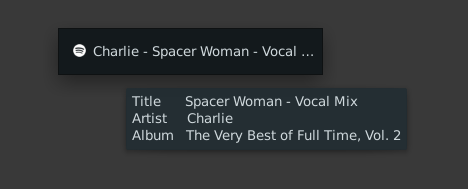

# xfce4-spotify-panel

## Description 
XFCE4 panel plugin to displays current playing song. Click icon to focus the sporify window (or lanuch spotify when not already running). Tooltip show more song information.

## Requirements
`xfce4-panel`

`xfce4-genmon-plugin`

`spotify`

`wmctr`

`xdotool`

## Installation

Add a Generic Monitor to your xfce 4 panel. Enter path to `spotify-panel.sh` in the Command field of the Properties section of the plugin. 

##

